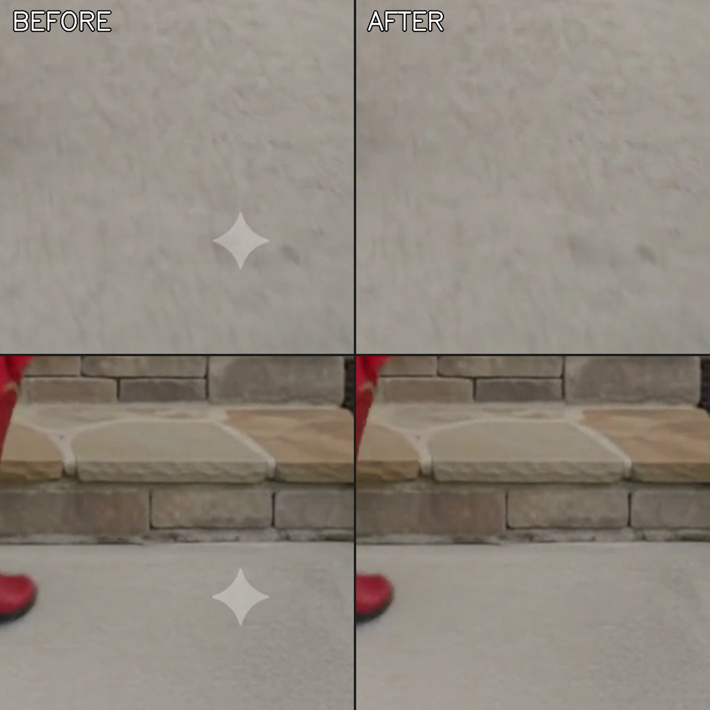

# clean-vid

Remove watermarks, logos, or unwanted objects from MP4 videos using **LaMa**, a neural inpainter that synthesizes plausible texture instead of just blurring. Output is seamless — even where subjects pass through the cleaned region, which is exactly where `ffmpeg -vf delogo` falls apart.



Two modes:
- **Static** — target stays at the same pixel position every frame (AI watermarks, TV station bugs, date stamps, fixed lower-thirds)
- **Tracking** — target moves through the video (drifting watermarks, boom mics dipping into frame, a person walking through a shot)

## Why this exists

Classical removal tools (`ffmpeg delogo`, `cv2.inpaint`) leave a visible smudge or streak — especially when the target sits next to a high-contrast edge or a subject crosses through the cleaned area. LaMa actually understands what *should* be there based on surrounding structure, so the result is invisible.

The tradeoff: ~0.25 s per frame on M-series Mac CPU (about 4× realtime for 24 fps clips), and a one-time ~196 MB model download.

## Quick start

**1. Install ffmpeg and Python 3.12.** (3.14 breaks pillow's old build setup. 3.13 works but isn't tested.)

```bash
brew install ffmpeg python@3.12
python3.12 -m venv ~/.venvs/clean-vid
~/.venvs/clean-vid/bin/pip install -r requirements.txt
```

First run will auto-download `big-lama.pt` (~196 MB) to `~/.cache/torch/hub/checkpoints/`.

**2. Generate a mask of the watermark.** Pick one MP4 from your input folder, find a timestamp where the watermark sits over a uniform-ish background (concrete, sky, wall) so it's easy to threshold:

```bash
~/.venvs/clean-vid/bin/python scripts/generate_mask.py \
  --video sample.mp4 \
  --timestamp 0.5 \
  --corner br \
  --output mask.pgm
```

Open `mask.pgm` in any image viewer to sanity-check that the white pixels outline the watermark shape with a small safety margin around it.

**3. Batch-process your folder.**

```bash
~/.venvs/clean-vid/bin/python scripts/remove_watermark.py \
  --src ./inputs \
  --out ./outputs \
  --mask mask.pgm
```

The script loops every `.mp4`, inpaints with LaMa, re-encodes with `libx264 crf 18 preset slow`, copies audio losslessly, skips outputs that already exist, and logs failures to `_errors.log` while continuing.

## Tracking mode (moving targets)

For a target that shifts position across frames — drifting watermark, boom mic, person walking — use the tracking script instead. You provide an initial bounding box on the first frame; OpenCV's CSRT tracker follows it through the video and LaMa inpaints each frame's bbox content.

```bash
# Extract a frame to eyeball the initial bbox
ffmpeg -ss 0 -i input.mp4 -frames:v 1 -update 1 frame0.png

# Open frame0.png in Preview (cmd-shift-4 to read pixel coordinates)
# Note the target's top-left X,Y and its width and height

~/.venvs/clean-vid/bin/python scripts/track_and_remove.py \
  --src input.mp4 \
  --out clean.mp4 \
  --bbox 596,1155,57,58 \
  --preview tracking.mp4   # optional: visualize the tracker's path
```

If the tracker drifts (you'll see red boxes in the preview MP4), the target probably looks too similar to its background. Either pick a frame where it's more visually distinct, or tighten the initial bbox to just the most contrasty part.

For non-rigid targets like a walking person, CSRT will lose them — see [SAM2 upgrade path](#advanced-sam2-for-non-rigid-targets).

## Use cases

This is a general video-inpainting pipeline. Real-world examples:

- **AI-generated videos** — corner badges from Veo, Sora, Runway, Pika, Kling, Luma in your own creative work. *Note: AI-generated content disclosure is the creator's responsibility. Tools like Google's SynthID embed cryptographic watermarks that are unaffected by visible-watermark removal. Use responsibly.*
- **Footage you own** — date stamps from old camcorder/dashcam clips, recording HUDs from GoPro/drone footage, channel watermarks on your own old YouTube videos
- **Production cleanup** — boom mics or wires that dipped into a shot, lower-thirds on news clips you're using as B-roll under fair use
- **Object removal** — a stray sign, power line, or passerby in a wide shot you couldn't reshoot

## When this won't work

- **Watermarks covering >25% of the frame.** LaMa hallucinates on large holes.
- **Audio watermarks.** This is video-only.
- **Anti-piracy watermarks deliberately designed to be tamper-resistant** (e.g. that embed subtle texture across the whole frame). Visible corner badges aren't in this category; some forensic watermarks are.
- **Targets that change appearance drastically frame to frame** — a person rotating, a deforming object. CSRT will lose them.
- **Long occlusion gaps in tracking mode.** If the target is hidden for many frames, the tracker drifts. Split the video at the occlusion and run twice with separate initial bboxes, then concat with ffmpeg.

## How it works

For each frame:

1. Find the watermark region (static mask or tracked bbox)
2. Crop a 256×256 window around it (~28× faster than running LaMa on the full frame, identical quality since LaMa only touches masked pixels)
3. Feed crop + mask into LaMa → get back a crop with the masked pixels filled in by the neural network
4. Paste back into the original frame
5. Pipe raw BGR bytes to ffmpeg, which encodes the new video and remuxes the original audio stream losslessly

LaMa ([simple-lama-inpainting](https://github.com/enesmsahin/simple-lama-inpainting)) is a wrapper around [LaMa](https://github.com/advimman/lama) — a Fourier-domain inpainting network from Samsung Research that does an unreasonably good job on the kind of holes this tool needs filled.

## Use as a Claude Code skill

Drop `SKILL.md` (and the `scripts/` folder) into a Claude Code skill directory and Claude can run the pipeline for you conversationally — pick a folder of videos, generate the mask, batch-process, verify the output. The frontmatter in `SKILL.md` includes triggering hints so Claude knows to use it when you describe the task.

## Advanced: SAM2 for non-rigid targets

CSRT works well for rigid targets that translate without changing shape much. For a walking person, a deforming object, or a thin wire, the modern answer is **SAM2** (Segment Anything 2) from Meta — click a point on frame 0, get a per-frame segmentation mask through the whole video.

Drop those per-frame masks into the same LaMa loop (replace the static mask in `remove_watermark.py` with a per-frame mask from SAM2's output) and the rest of the pipeline is unchanged. Not bundled here because SAM2 adds another 150-300 MB model download and is 10-50× slower than CSRT on CPU.

## Common gotchas

- **"It's still there"** after first pass → eyeball estimates of watermark position are usually 10-20 px off. `generate_mask.py` prints the detected bbox; open `mask.pgm` and confirm the white shape covers the target with margin.
- **Python 3.14 venv won't install simple-lama-inpainting** because pillow's older build chokes. Use 3.12.
- **MPS (Apple GPU) errors** — `simple-lama-inpainting` doesn't move inputs to MPS automatically. CPU is fine; the 256×256 crop keeps it fast enough that GPU integration isn't worth the pain.
- **Mask polarity differs by tool.** This pipeline uses LaMa's convention: white = inpaint. If you reuse the mask with `cv2.xphoto.inpaint` (FSR), invert it.

## License

MIT — see [LICENSE](LICENSE).

LaMa itself is Apache 2.0. simple-lama-inpainting is MIT.
