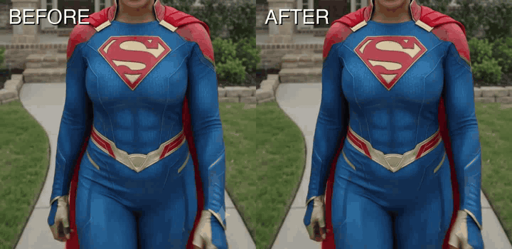

# clean-vid

**Remove watermarks from your videos automatically — no editing skills needed.**

The watermark disappears. The video stays. Nobody can tell.

> Same clip, side-by-side. Watermark on the left, gone on the right. ([static comparison here](examples/before-after.png) if the GIF won't load.)

---

## How to use it

### Step 1 — Get Claude Code

It's free and runs on your computer. Download it here: **[claude.com/claude-code](https://www.anthropic.com/claude-code)**

(macOS and Windows both work. Takes about 2 minutes to set up.)

### Step 2 — Download the skill

Grab the latest `clean-vid.skill` from the **[Releases page](https://github.com/Chefy3x/clean-vid/releases/latest)**.

### Step 3 — Drop it into Claude Code

Drag `clean-vid.skill` into Claude Code. That's it. You're done.

### Step 4 — Tell Claude what you want

Open Claude Code and say something like:

> "Remove the watermarks from the videos in `/Users/me/Downloads/clips`"

Claude will handle everything else — finding the watermark, cleaning every video in the folder, saving the results next to the originals. First run downloads a model file (~200 MB), then it's fast.

---

## What it can do

- ✅ Remove corner watermarks from AI videos (Veo, Sora, Runway, Pika, Kling, Luma)
- ✅ Remove TV station logos, date stamps, news graphics
- ✅ Remove boom mics, wires, or other objects that swing into your shot
- ✅ Works on folders of videos at once
- ✅ Keeps audio untouched
- ✅ Skips files it's already done — safe to re-run

## What it can't do

- ❌ Watermarks that cover more than ~25% of the screen
- ❌ Audio watermarks
- ❌ Videos so badly mangled the underlying content can't be guessed

## Heads up

If you're using this on AI-generated videos to repost as your own work, that's on you. Most platforms (and the FTC) expect AI content to be disclosed. Google's Veo also embeds an invisible cryptographic watermark called SynthID that this tool doesn't touch — so even with the sparkle gone, the video can still be identified as AI-generated by anything that checks.

Use it on your own footage and you're fine.

---

## I'm a developer

The Python scripts work standalone without Claude Code — `ffmpeg` + a venv and you're off. See **[DEVELOPERS.md](DEVELOPERS.md)** for the technical details, install steps, and how to plug in your own masks or tracking.

---

MIT License — see [LICENSE](LICENSE). Uses [LaMa](https://github.com/advimman/lama) (Apache 2.0) via [simple-lama-inpainting](https://github.com/enesmsahin/simple-lama-inpainting) (MIT).
